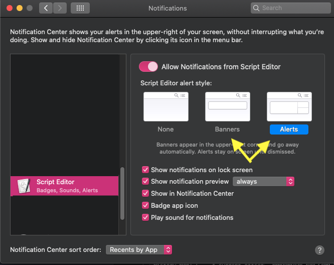
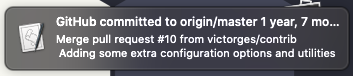
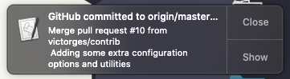

# git-notify

This little bash script will watch your origin/master for updates every 60 seconds and uses notify-send to alert you of new commits.

Born from lacking answers after asking about [any tools that can notify about commits to remote git repos on StackOverflow](http://stackoverflow.com/questions/5082001/is-there-a-tool-to-watch-a-remote-git-repository-on-ubuntu-and-do-popup-notificat).

## Installation
Just download `git-notify` and ensure it's folder is located in your path:

```bash
git clone git@github.com:jakeonrails/git-notify.git
# If you use bash
echo "export PATH=/your/full/path/to/git-notify:\$PATH" >> ~/.bashrc && source ~/.bashrc
# If you use zshrc
echo "export PATH=/your/full/path/to/git-notify:\$PATH" >> ~/.zshrc && source ~/.zshrc
```

## Usage

    ######################################################
    # git-notify: Simple bash script to watch git repos and use desktop notifications upon detection of new commits.
    #
    # USAGE: ./git-notify [OPTIONS]
    #  Alternatively, add git-notify to your path by specifying the path to the repo in your shell's config:
    #   * echo 'export PATH=/your/full/path/to/git-notify:$PATH' >> ~/.zshrc
    #   * echo 'export PATH=/your/full/path/to/git-notify:$PATH' >> ~/.bashrc
    #  And then use just: "git-notify [OPTIONS]"
    #
    # OPTIONS:
    #  -b <BRANCH>:         branch        Specifies the branch to run against (default origin/master)
    #  -r <REPOSITORY>:     repository    Specify what repository to watch (default origin/master)
    #  -t <TIME>:           refresh_delay Time to wait inbetween checking, in seconds (default 60)
    #  -a:                  async         Runs the job in the background (via &)
    #  -v:                  verbose       Set verbose logging on (adds "[date]: " prefix)
    #  -l:                  bg_jobs       Find all git-notify background jobs currently running
    #  -k:                  kill          Kill all backgrounded git-notify jobs
    #  -h:                  help          Print help and exit
    ######################################################


## Options

### -b \<BRANCH\>
* Specify which branch to watch, default `origin/master`.

### -r \<REPOSITORY\>
* Specify which remote repository to watch, default `origin/master`

### -a
> async
* If you use the `-a` option, the script will run in the background. If you want to kill it later, you can do:

    ```bash
    ps aux | grep '[g]it-notify'
    # Or, using git-notify to search for any instances of itself running:
    git-notify -l
    ```

    Which will output something like:

    ```bash
        USER      9541  0.0  0.0  12012  1392 pts/3    S    12:54   0:00 /bin/bash ./git-notify
    ```

    Note the first number in the list, 9541, that is the PID of the script. You can now terminate it like so:

    ```bash
    kill 9541
    ```

### -l
> list
* List all currently running/backgrounded `git-notify` processes.

### -k
> kill
* Kill all currently running/backgrounded `git-notify` processes (which would be visible via the `-l` flag

## Changing Notifcation Type (OSX)
If you want to change the AppleScript notifcation type, that is a setting that is controlled in your `System Preferences --> Notifications` tab. The git-notify will use the Script Editor application, so you should modify those settings.

By default, **Script Editor** uses the "Banners" type message. Switching to the "Alerts" tab will allow for notifcations that have a "close" button to be dismissed individually.



### Banners type



### Alerts type




#### Original tool
> Author creds: Jake Moffatt, jakeonrails@gmail.com

